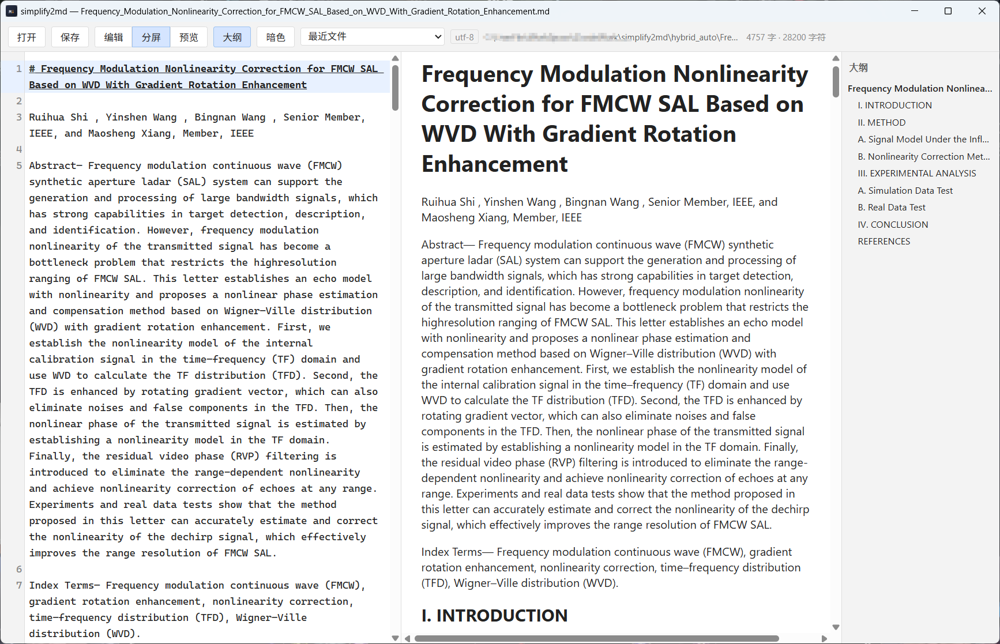

# simplify2md

> 极简 Markdown 查看编辑器 —— 浏览为主、编辑为辅。Windows 单文件，秒开。
> A minimal Markdown viewer & editor for Windows. One file, instant start.

<p align="center">
  
</p>

## 特性

- **完整渲染管线**（移植自 [soloMD](https://github.com/whichonefen/soloMD)）：markdown-it + KaTeX 公式 + highlight.js 代码高亮 + 表格 / 脚注 / 任务列表 / 标题锚点
- **mineru / PDF 转换文档兼容**：自动修复 `\\命令`、`\_ {下标}`、`\&`、`\left{` 等 LaTeX 转义污染，多行公式行距按内容分级修正——打开即正常显示，无需手工清理
- **CodeMirror 6 编辑器**：Markdown 语法高亮、行号、软换行、撤销历史；输入法组词期跳过同步，中文输入不吃字
- **三种视图**：编辑 / 分屏（双向滚动同步）/ 预览
- **文内查找**：Ctrl+F 匹配计数，编辑区选中定位 + 预览黄色高亮，F3 循环跳转
- **大纲导航**：标题抽取，点击直达
- **编码与换行保真**：自动识别 UTF-8 / GB18030 / Big5，CRLF / LF 按原样写回，不损坏老文件
- **外部更改检测**：应用外修改自动重载；有未保存改动时弹窗询问
- **暗色主题 · 字数统计 · 最近文件与启动恢复 · 未保存关闭守卫**

## 下载安装

从 [Releases](../../releases) 页面下载（Windows 10/11 x64）：

| 文件 | 说明 |
|---|---|
| `simplify2md-amd64-installer.exe` | 安装版：开始菜单 / 桌面快捷方式、卸载器、注册 `.md` / `.markdown` 文件关联（卸载时自动还原） |
| `simplify2md.exe` | 便携版：单文件，拷贝即用 |

两个版本均无签名，首次运行如遇 SmartScreen 提示，选择"更多信息 → 仍要运行"即可。
WebView2 运行时 Windows 10/11 自带；缺失时安装版会自动补装。

## 快捷键

| 按键 | 功能 |
|---|---|
| `Ctrl+O` / `Ctrl+S` | 打开 / 保存 |
| `Ctrl+F` | 查找（`Enter` 下一个、`Shift+Enter` 上一个） |
| `F3` / `Shift+F3` | 下一个 / 上一个匹配 |
| `Esc` | 关闭查找 / 取消弹窗 |

## 从源码构建

环境要求：Go 1.25+、Node.js 18+、[Wails CLI v2](https://wails.io/docs/gettingstarted/installation)；
打安装包另需 [NSIS](https://nsis.sourceforge.io)。

```bash
wails dev            # 开发模式（热重载）
wails build          # 便携版 → build/bin/simplify2md.exe
wails build -nsis    # NSIS 安装包 → build/bin/simplify2md-amd64-installer.exe
```

测试：

```bash
go test ./...          # Go 单测：编码检测 / 换行保真 / 图片路径解析
cd frontend
npm install
node node_modules/tsx/dist/cli.mjs test-pipeline.ts   # 渲染管线测试
```

> 渲染管线测试依赖本地 `hybrid_auto/` 样本（mineru 转换的真实论文，不入库），
> 克隆后需自备一份才能运行该脚本。

## 技术栈

Wails v2 (Go + WebView2) · Vue 3 · CodeMirror 6 · markdown-it · KaTeX · highlight.js · fsnotify

## 目录结构

```
mdview/            应用主体（Go 后端 + Vue 前端）
  main.go          Wails 入口
  app.go           文件读写、编码/换行检测、外部监听、图片加载
  frontend/src/
    App.vue        界面与交互
    lib/cm-editor.ts    CodeMirror 编辑器装配
    lib/markdown.ts     渲染管线（含 mineru 转义修复、公式行距修正）
  build/           图标与安装器工程
hybrid_auto/       本地渲染测试样本（不入库）
```

## License

[MIT](LICENSE)
